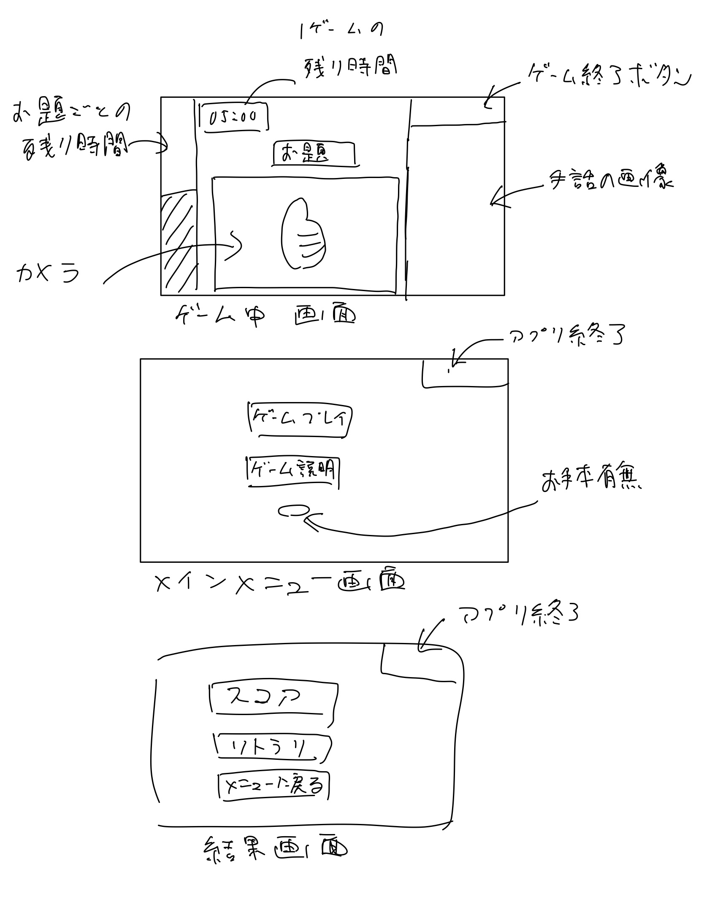

# 設計書

## 目的

* ゲーム形式により、子供でも学習できるようにする
* 手話の学習を促し、認識を広める

## 用語定義

| 用語                 | 意味                                                                             |
| :------------------- | :------------------------------------------------------------------------------- |
| **お題リスト** | ゲームで使用するお題（ジェスチャー名）を記述したテキストファイル (`array.txt`) |
| **信頼度**     | ジェスチャー認識モデルが、その予測が正しいと判断する確率                         |

## 機能

| 大分類               | 中分類               | 小分類                 | 説明                                                                                        |
| :------------------- | :------------------- | :--------------------- | :------------------------------------------------------------------------------------------ |
| アプリケーション管理 | 画面遷移             | 初期画面表示           | アプリケーション起動時にスタート画面を表示する。                                            |
| アプリケーション管理 | 画面遷移             | 画面間遷移             | スタート、ゲームプレイ、ゲームオーバーの各画面間を遷移する。                                |
| アプリケーション管理 | ウィンドウ制御       | フルスクリーン         | アプリケーションをフルスクリーンで起動・表示する。                                          |
| アプリケーション管理 | ウィンドウ制御       | フルスクリーン解除     | Escapeキーでフルスクリーンモードを解除する。                                                |
| アプリケーション管理 | アプリケーション終了 | アプリケーション終了   | スタート画面の「Quit」ボタンでアプリケーションを終了する。                                  |
| スタート画面         | ゲーム開始           | ゲームプレイ画面へ遷移 | 「Start Game」ボタンを押すと、ゲームプレイ画面に移動してゲームを開始する。                  |
| ゲームプレイ画面     | ゲーム進行           | 制限時間タイマー       | 60秒のカウントダウンタイマーを表示する。0秒になるとゲームオーバー画面へ遷移する。           |
| ゲームプレイ画面     | ゲーム進行           | お題変更タイマー       | 5秒周期のゲージタイマーを表示する。1周するごとにお題が変更される。                          |
| ゲームプレイ画面     | ゲーム進行           | スコア加算             | お題に合ったジェスチャーを成功させるとスコアが1加算される。                                 |
| ゲームプレイ画面     | お題表示             | お題の読み込み         | `array.txt` からお題リストを読み込む。                                                    |
| ゲームプレイ画面     | お題表示             | お題のランダム表示     | お題リストからランダムに選択したジェスチャー名を表示する。                                  |
| ゲームプレイ画面     | 映像表示             | カメラ映像取得         | PCに接続されたWebカメラの映像を取得し、画面に表示する。                                     |
| ゲームプレイ画面     | ジェスチャー認識     | 手の検出               | MediaPipeライブラリを使用し、カメラ映像から手の骨格（ランドマーク）を検出する。             |
| ゲームプレイ画面     | ジェスチャー認識     | ジェスチャーの分類     | 検出した手のランドマークを学習済みモデルに入力し、ジェスチャー名を予測する。                |
| ゲームプレイ画面     | ジェスチャー認識     | 正誤判断               | 予測されたジェスチャーが現在のお題と一致し、かつ信頼度が80%以上の場合に「成功」と判断する。 |
| ゲームプレイ画面     | ゲーム中断           | メインメニューに戻る   | 「Main Menu」ボタンでゲームを中断し、スタート画面に戻る。                                   |
| ゲームオーバー画面   | 結果表示             | 最終スコア表示         | ゲームプレイ結果の最終スコアを表示する。                                                    |
| ゲームオーバー画面   | リプレイ             | ゲーム再挑戦           | 「Restart Game」ボタンで、再度ゲームプレイ画面に遷移してゲームをやり直す。                  |
| ゲームオーバー画面   | 画面遷移             | メインメニューに戻る   | 「Main Menu」ボタンでスタート画面に戻る。                                                   |

## 入力データ

| 入力データ                 | 説明                                                                     |
| :------------------------- | :----------------------------------------------------------------------- |
| お題リスト (`array.txt`) | お題として使用するジェスチャー名を1行に1つずつ記述したテキストファイル。 |
| カメラ映像                 | PCに接続されたWebカメラからのリアルタイム映像データ。                    |

## 画面仕様

| 画面               | 役割・目的                                                                               |
| :----------------- | :--------------------------------------------------------------------------------------- |
| スタート画面       | ゲーム開始やアプリケーションの終了を選択・実行する。                                     |
| ゲームプレイ画面   | カメラ映像を見ながらお題のジェスチャーを行い、スコアを競うメイン画面。                   |
| ゲームオーバー画面 | ゲーム結果（最終スコア）を表示し、リプレイするかメインメニューに戻るかを選択・実行する。 |

## 開発環境

* ローカル環境

## 使用するライブラリ

* `tkinter` (Python 3.11.4 Standard Library)
* `opencv-python`: 4.11.0.86
* `Pillow`: 11.2.1
* `tensorflow`: 2.19.1
* `mediapipe`: 0.10.21
* `pandas`: 2.3.1
* `numpy`: 1.26.4
* `scikit-learn`: 1.7.1
